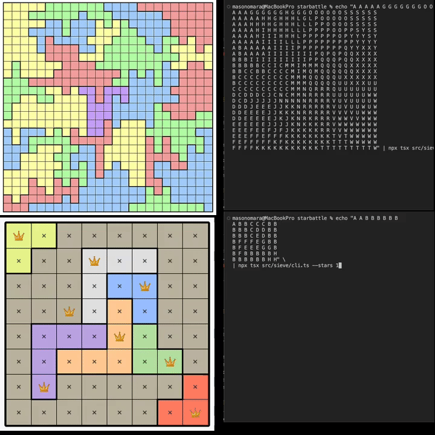
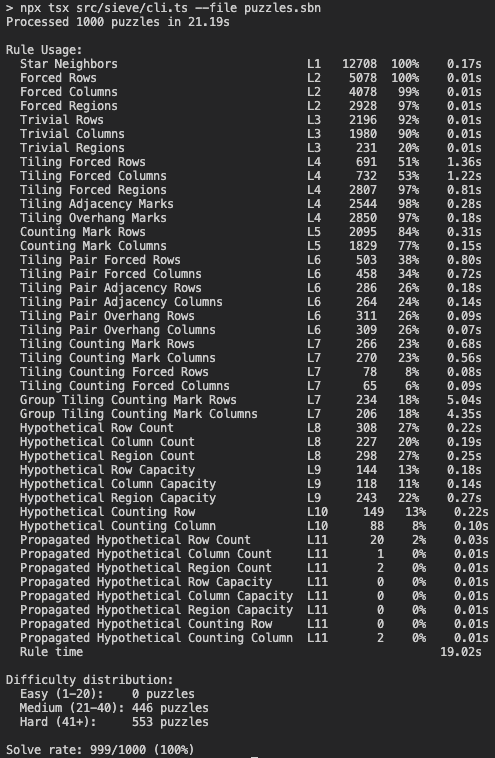

# Star Battle Generator



A production rule system that generates Star Battle puzzles solvable by humans - no brute-force guessing or backtracking. Full system details in [Production Rules](PRODUCTION_RULES.md).

**Currently building a mobile puzzle app using this engine. If interested, feel free to reach out at mason@omaratechnologydesign.com**

## Why Production Rules?

Generating a valid Star Battle layout is easy. Generating one that a human can solve through logic alone is hard. Each production rule in this system corresponds to a deduction a human can perform - the solver never guesses, so neither does the player.

## Architecture

- **Generator** - Produces randomized grids with region layouts and validates boards with tiling assignment.
- **Solver** - Applies production rules in logical order until a solution or invalid state is reached.
- **Production Rules** - Logical solving techniques a human can perform, derived from [Kris De Asis's Star Battle Guide](https://kris.pengy.ca/starbattle) and [KrazyDad's Two Not Touch Advanced Tutorial](https://krazydad.com/twonottouch/adv_tutorial/).
- **Sieve** - Coordinates generation and solving. Assigns difficulty ratings based on rule usage.

## Getting Started

```bash
git clone https://github.com/masonomara/star-battle.git
cd star-battle
npm install
```

### Generate Puzzles

```bash
npx tsx src/cli.ts                        # Default: 10x10, 2 stars
npx tsx src/cli.ts --size 8               # 8x8 grid
npx tsx src/cli.ts --stars 1              # 1 star per container
npx tsx src/cli.ts --count 5              # Generate 5 puzzles
npx tsx src/cli.ts --seed 417582859       # Reproducible generation from seed
```

### Solve Custom Puzzles

Pipe a space-separated region grid via stdin. Each row is one line, each cell is a region letter:

```bash
echo "A A B B
A A B B
C C D D
C C D D" | npx tsx src/cli.ts --stars 1
```

For batch solving, create a `.sbn` file with one puzzle string per line - format is `{size}x{stars}.{layout}`, where the layout is `size × size` region characters read left-to-right, top-to-bottom:

```
10x2.AAAABBBBBCDDDDBEEBBCDDDDBECBCCDDBBBECCCCDDBBBEFCCCDDGGFFFGGCDDGGFGGGGCHGGGGGGGICHGGJJJJGIIHGIIIIIIII
```

```bash
npx tsx src/cli.ts --file sample-puzzle.sbn
npx tsx src/cli.ts --file sample-puzzle.sbn --verbose    # Details per puzzle
npx tsx src/cli.ts --file sample-puzzle.sbn --unsolved   # Only show failures
npx tsx src/cli.ts --file sample-puzzle.sbn --trace      # Step-by-step solve trace
```

### Filter by Difficulty

```bash
npx tsx src/cli.ts --minDiff 20              # Harder puzzles only
npx tsx src/cli.ts --maxDiff 10              # Easier puzzles only
npx tsx src/cli.ts --minDiff 15 --maxDiff 25 # Specific range
```

### Run Tests

```bash
npm test
```

### CLI Reference

- `--size` - Grid size (4–25, default: 10)
- `--stars` - Stars per container (1–6, default: 2)
- `--count` - Puzzles to generate (1–300, default: 1)
- `--seed` - Deterministic generation seed (random by default)
- `--minDiff` - Minimum difficulty
- `--maxDiff` - Maximum difficulty
- `--file` - Solve puzzles from a `.sbn` file
- `--verbose` - Show details per puzzle
- `--unsolved` - Only output unsolved puzzles
- `--trace` - Step-by-step solve trace
- `--help` - Show options

## Production Rules Overview

Rules combine an **Observation** (how you see the board) with a **Technique** (how you reason) to produce a **Deduction** (mark or placement). The solver cycles through rules in order, restarting from the top whenever a rule fires.

1. **Star Neighbors** - Direct × Inference
2. **Forced Placements** - Direct × Inference
3. **Trivial Marks** - Direct × Inference
4. **Tiling Enumeration** - Tiling × Enumeration
5. **Counting Enumerations** - Counting × Enumeration
6. **Tiling Pairs** - Tiling × Enumeration
7. **Tiling Counting** - Tiling + Counting × Enumeration
8. **Direct Hypotheticals** - Direct × Hypothetical
9. **Tiling Hypotheticals** - Tiling × Hypothetical
10. **Counting Hypotheticals** - Counting × Hypothetical
11. **Propagated Hypotheticals** - Direct + Tiling + Counting × Hypothetical

See [Production Rules](PRODUCTION_RULES.md) for full definitions of each rule.

## Results



1000 puzzles solved in 21.19s — **999/1000 (100%)**

### Rule Usage

| Rule                                    | Level | Firings | Puzzles | Time       |
| --------------------------------------- | ----- | ------- | ------- | ---------- |
| Star Neighbors                          | L1    | 12708   | 100%    | 0.17s      |
| Forced Rows                             | L2    | 5078    | 100%    | 0.01s      |
| Forced Columns                          | L2    | 4078    | 99%     | 0.01s      |
| Forced Regions                          | L2    | 2928    | 97%     | 0.01s      |
| Trivial Rows                            | L3    | 2196    | 92%     | 0.01s      |
| Trivial Columns                         | L3    | 1980    | 90%     | 0.01s      |
| Trivial Regions                         | L3    | 231     | 20%     | 0.01s      |
| Tiling Forced Rows                      | L4    | 691     | 51%     | 1.36s      |
| Tiling Forced Columns                   | L4    | 732     | 53%     | 1.22s      |
| Tiling Forced Regions                   | L4    | 2807    | 97%     | 0.81s      |
| Tiling Adjacency Marks                  | L4    | 2544    | 98%     | 0.28s      |
| Tiling Overhang Marks                   | L4    | 2850    | 97%     | 0.18s      |
| Counting Mark Rows                      | L5    | 2095    | 84%     | 0.31s      |
| Counting Mark Columns                   | L5    | 1829    | 77%     | 0.15s      |
| Tiling Pair Forced Rows                 | L6    | 503     | 38%     | 0.80s      |
| Tiling Pair Forced Columns              | L6    | 458     | 34%     | 0.72s      |
| Tiling Pair Adjacency Rows              | L6    | 286     | 26%     | 0.18s      |
| Tiling Pair Adjacency Columns           | L6    | 264     | 24%     | 0.14s      |
| Tiling Pair Overhang Rows               | L6    | 311     | 26%     | 0.09s      |
| Tiling Pair Overhang Columns            | L6    | 309     | 26%     | 0.07s      |
| Tiling Counting Mark Rows               | L7    | 266     | 23%     | 0.68s      |
| Tiling Counting Mark Columns            | L7    | 270     | 23%     | 0.56s      |
| Tiling Counting Forced Rows             | L7    | 78      | 8%      | 0.08s      |
| Tiling Counting Forced Columns          | L7    | 65      | 6%      | 0.09s      |
| Group Tiling Counting Mark Rows         | L7    | 234     | 18%     | 5.04s      |
| Group Tiling Counting Mark Columns      | L7    | 206     | 18%     | 4.35s      |
| Hypothetical Row Count                  | L8    | 308     | 27%     | 0.22s      |
| Hypothetical Column Count               | L8    | 227     | 20%     | 0.19s      |
| Hypothetical Region Count               | L8    | 298     | 27%     | 0.25s      |
| Hypothetical Row Capacity               | L9    | 144     | 13%     | 0.18s      |
| Hypothetical Column Capacity            | L9    | 118     | 11%     | 0.14s      |
| Hypothetical Region Capacity            | L9    | 243     | 22%     | 0.27s      |
| Hypothetical Counting Row               | L10   | 149     | 13%     | 0.22s      |
| Hypothetical Counting Column            | L10   | 88      | 8%      | 0.10s      |
| Propagated Hypothetical Row Count       | L11   | 20      | 2%      | 0.03s      |
| Propagated Hypothetical Column Count    | L11   | 1       | 0%      | 0.01s      |
| Propagated Hypothetical Region Count    | L11   | 2       | 0%      | 0.01s      |
| Propagated Hypothetical Row Capacity    | L11   | 0       | 0%      | 0.01s      |
| Propagated Hypothetical Column Capacity | L11   | 0       | 0%      | 0.01s      |
| Propagated Hypothetical Region Capacity | L11   | 0       | 0%      | 0.01s      |
| Propagated Hypothetical Counting Row    | L11   | 0       | 0%      | 0.01s      |
| Propagated Hypothetical Counting Column | L11   | 2       | 0%      | 0.01s      |
| **Rule time**                           |       |         |         | **19.02s** |
