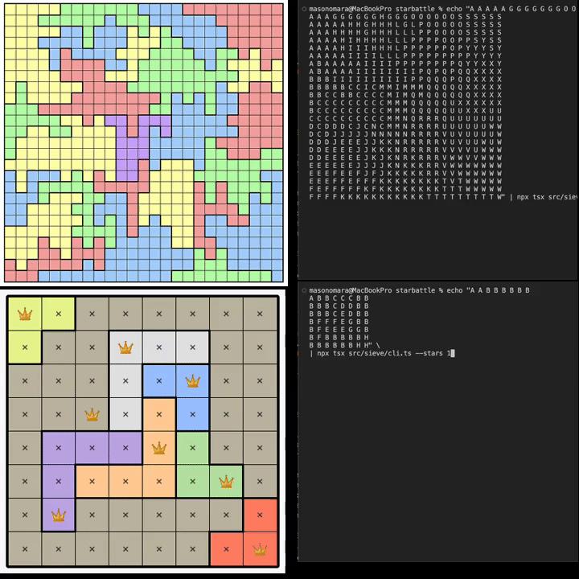
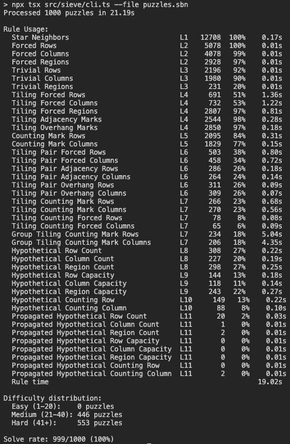

# Star Battle Generator



A production rule system that generates Star Battle puzzles solvable by humans - no brute-force guessing or backtracking. Full system details in [Production Rules](PRODUCTION_RULES.md).

**Currently building a mobile puzzle app using this engine. If interested, feel free to reach out at mason@omaratechnologydesign.com**

## Why Production Rules?

Generating a valid Star Battle layout is easy. Generating one that a human can solve through logic alone is hard. Each production rule in this system corresponds to a deduction a human can perform - the solver never guesses, so neither does the player.

## Architecture

- **Generator** - Produces randomized grids with region layouts and validates boards with tiling assignment.
- **Solver** - Applies production rules in logical order until a solution or invalid state is reached.
- **Production Rules** - Logical solving techniques a human can perform, derived from [Kris De Asis's Star Battle Guide](https://kris.pengy.ca/starbattle) and [KrazyDad's Two Not Touch Advanced Tutorial](https://krazydad.com/twonottouch/adv_tutorial/).
- **Sieve** - Coordinates generation and solving. Assigns difficulty ratings based on rule usage.

## Getting Started

```bash
git clone https://github.com/masonomara/star-battle.git
cd star-battle
npm install
```

### Generation Modes

There are two generation strategies. Which one to use depends on the puzzle size.

**Forward generation** (default) — generates a random region layout, then tries to solve it. Efficient for small puzzles where the rule-based solver succeeds often.

```bash
npx tsx src/cli.ts --size 10 --stars 2 --count 120
```

**Inverse generation** (`--inverse --backtrack`) — places a valid star solution first, then builds regions around it. Required for large puzzles where random layouts are almost never rule-solvable. The `--backtrack` flag adds a second acceptance path: puzzles the rule-based solver can't prove are still accepted if a backtracking uniqueness check confirms exactly one solution exists (these get `difficulty=71`, `maxLevel=12`).

```bash
npx tsx src/cli.ts --size 17 --stars 4 --count 120 --inverse --backtrack
```

**When to use which:**

| Size / Stars | Recommended mode |
| --- | --- |
| ≤ 10×2, ≤ 8×1 | Forward (default) |
| 14×3 | Forward works (~1 in 65k seeds yields a puzzle) |
| 17×4 and larger | `--inverse --backtrack` — forward yields 0 |

Both modes write to the same `.sbn` format and resume seamlessly. You can run forward and inverse against the same output file at different times.

### Output Files

Every generation run produces two files:

**`puzzles-{size}x{stars}.sbn`** (e.g. `puzzles-17x4.sbn`)

The puzzle library. One puzzle string per line, format:

```
17x4.DDDDIIIIIIIIKKKKKDDD...s-176440323d81l5c129v1
```

Fields encoded in the suffix: `s` = seed, `d` = difficulty (1–100), `l` = max rule level used (1–12), `c` = solver cycle count, `v` = version. This is what your app reads. You can `cat`, `grep`, `wc -l`, or filter by difficulty with standard tools.

**`puzzles-{size}x{stars}.sbn.state`**

The resume bookmark. JSON file tracking the base seed, how many seeds have been searched, and how many puzzles were found. The next run reads this and picks up exactly where the last one stopped — no seeds are ever repeated.

```json
{"size":17,"stars":4,"baseSeed":-176440323,"attempts":8400,"found":26}
```

Delete the `.state` file only if you want to start over with a fresh seed space. The `.sbn` file is independent — delete it to clear the puzzle library without resetting the search position, or keep both to continue accumulating.

> The `.state` file is only written during generation. It has no effect on `--file` (batch solving) or stdin mode.

### Solve Custom Puzzles

Pipe a space-separated region grid via stdin. Each row is one line, each cell is a region letter:

```bash
echo "A A B B
A A B B
C C D D
C C D D" | npx tsx src/cli.ts --stars 1
```

For batch solving, create a `.sbn` file with one puzzle string per line - format is `{size}x{stars}.{layout}`, where the layout is `size × size` region characters read left-to-right, top-to-bottom:

```
10x2.AAAABBBBBCDDDDBEEBBCDDDDBECBCCDDBBBECCCCDDBBBEFCCCDDGGFFFGGCDDGGFGGGGCHGGGGGGGICHGGJJJJGIIHGIIIIIIII
```

```bash
npx tsx src/cli.ts --file sample-puzzle.sbn
npx tsx src/cli.ts --file sample-puzzle.sbn --verbose    # Details per puzzle
npx tsx src/cli.ts --file sample-puzzle.sbn --unsolved   # Only show failures
npx tsx src/cli.ts --file sample-puzzle.sbn --trace      # Step-by-step solve trace
```

### Run Tests

```bash
npm test
```

### CLI Reference

#### Generation flags

| Flag | Type | Default | Description |
| --- | --- | --- | --- |
| `--size` | int | `10` | Grid size N (produces an N×N puzzle with N regions). Valid: 4–25. |
| `--stars` | int | `2` | Stars required per row, column, and region. Valid: 1–6, and must be ≤ size/2. |
| `--count` | int | `1` | Stop after finding this many new puzzles and append them to the output file. |
| `--output` | path | `puzzles-{size}x{stars}.sbn` | Output `.sbn` file. A `.state` bookmark is written alongside it automatically. |
| `--inverse` | flag | off | Use inverse generation: place a valid star solution first, then grow regions around it. Required for large puzzles (17×4+). Without this, large puzzles yield 0 results. |
| `--backtrack` | flag | off | When `--inverse` is on, also accept puzzles that the rule-based solver can't prove but that a backtracking uniqueness check confirms have exactly one solution. These puzzles get `difficulty=71`, `maxLevel=12`. Adds ~100ms per candidate but significantly increases yield. |
| `--minDiff` | int | — | Only keep puzzles at or above this difficulty score (1–100). |
| `--maxDiff` | int | — | Only keep puzzles at or below this difficulty score (1–100). |
| `--workers` | int | CPU count | Number of parallel worker threads. Each worker runs its own WASM instance independently. Scaling is near-linear up to CPU count. |

#### File / solve flags

| Flag | Type | Description |
| --- | --- | --- |
| `--file` | path | Batch-solve all puzzles in a `.sbn` file and print statistics. Does not generate. |
| `--verbose` | flag | Print per-puzzle results when using `--file`. |
| `--unsolved` | flag | Print only puzzles the solver could not solve when using `--file`. |
| `--trace` | flag | Print a step-by-step solve trace. Works with `--file` or stdin. |
| `--help` | flag | Print usage summary. |

#### Difficulty scoring

Difficulty is computed from the highest rule level the solver needed (`maxLevel`) and the number of solver cycles. The scale is roughly:

| Score | Description |
| --- | --- |
| 1–20 | Easy — solved with basic inference only (L1–L3) |
| 21–40 | Medium — requires tiling enumeration (L4–L5) |
| 41–60 | Hard — requires tiling pairs or hypotheticals (L6–L9) |
| 61–80 | Expert — requires propagated hypotheticals (L10–L11) |
| 71 | Backtrack-only — rule solver couldn't prove it; uniqueness confirmed via backtracking (`maxLevel=12`) |

## Production Rules Overview

Rules combine an **Observation** (how you see the board) with a **Technique** (how you reason) to produce a **Deduction** (mark or placement). The solver cycles through rules in order, restarting from the top whenever a rule fires.

1. **Star Neighbors** - Direct × Inference
2. **Forced Placements** - Direct × Inference
3. **Trivial Marks** - Direct × Inference
4. **Tiling Enumeration** - Tiling × Enumeration
5. **Counting Enumerations** - Counting × Enumeration
6. **Tiling Pairs** - Tiling × Enumeration
7. **Tiling Counting** - Tiling + Counting × Enumeration
8. **Direct Hypotheticals** - Direct × Hypothetical
9. **Tiling Hypotheticals** - Tiling × Hypothetical
10. **Counting Hypotheticals** - Counting × Hypothetical
11. **Propagated Hypotheticals** - Direct + Tiling + Counting × Hypothetical

See [Production Rules](PRODUCTION_RULES.md) for full definitions of each rule.

## Results



1000 puzzles solved in 21.19s — **999/1000 (100%)**

### Rule Usage

| Rule                                    | Level | Firings | Puzzles | Time       |
| --------------------------------------- | ----- | ------- | ------- | ---------- |
| Star Neighbors                          | L1    | 12708   | 100%    | 0.17s      |
| Forced Rows                             | L2    | 5078    | 100%    | 0.01s      |
| Forced Columns                          | L2    | 4078    | 99%     | 0.01s      |
| Forced Regions                          | L2    | 2928    | 97%     | 0.01s      |
| Trivial Rows                            | L3    | 2196    | 92%     | 0.01s      |
| Trivial Columns                         | L3    | 1980    | 90%     | 0.01s      |
| Trivial Regions                         | L3    | 231     | 20%     | 0.01s      |
| Tiling Forced Rows                      | L4    | 691     | 51%     | 1.36s      |
| Tiling Forced Columns                   | L4    | 732     | 53%     | 1.22s      |
| Tiling Forced Regions                   | L4    | 2807    | 97%     | 0.81s      |
| Tiling Adjacency Marks                  | L4    | 2544    | 98%     | 0.28s      |
| Tiling Overhang Marks                   | L4    | 2850    | 97%     | 0.18s      |
| Counting Mark Rows                      | L5    | 2095    | 84%     | 0.31s      |
| Counting Mark Columns                   | L5    | 1829    | 77%     | 0.15s      |
| Tiling Pair Forced Rows                 | L6    | 503     | 38%     | 0.80s      |
| Tiling Pair Forced Columns              | L6    | 458     | 34%     | 0.72s      |
| Tiling Pair Adjacency Rows              | L6    | 286     | 26%     | 0.18s      |
| Tiling Pair Adjacency Columns           | L6    | 264     | 24%     | 0.14s      |
| Tiling Pair Overhang Rows               | L6    | 311     | 26%     | 0.09s      |
| Tiling Pair Overhang Columns            | L6    | 309     | 26%     | 0.07s      |
| Tiling Counting Mark Rows               | L7    | 266     | 23%     | 0.68s      |
| Tiling Counting Mark Columns            | L7    | 270     | 23%     | 0.56s      |
| Tiling Counting Forced Rows             | L7    | 78      | 8%      | 0.08s      |
| Tiling Counting Forced Columns          | L7    | 65      | 6%      | 0.09s      |
| Group Tiling Counting Mark Rows         | L7    | 234     | 18%     | 5.04s      |
| Group Tiling Counting Mark Columns      | L7    | 206     | 18%     | 4.35s      |
| Hypothetical Row Count                  | L8    | 308     | 27%     | 0.22s      |
| Hypothetical Column Count               | L8    | 227     | 20%     | 0.19s      |
| Hypothetical Region Count               | L8    | 298     | 27%     | 0.25s      |
| Hypothetical Row Capacity               | L9    | 144     | 13%     | 0.18s      |
| Hypothetical Column Capacity            | L9    | 118     | 11%     | 0.14s      |
| Hypothetical Region Capacity            | L9    | 243     | 22%     | 0.27s      |
| Hypothetical Counting Row               | L10   | 149     | 13%     | 0.22s      |
| Hypothetical Counting Column            | L10   | 88      | 8%      | 0.10s      |
| Propagated Hypothetical Row Count       | L11   | 20      | 2%      | 0.03s      |
| Propagated Hypothetical Column Count    | L11   | 1       | 0%      | 0.01s      |
| Propagated Hypothetical Region Count    | L11   | 2       | 0%      | 0.01s      |
| Propagated Hypothetical Row Capacity    | L11   | 0       | 0%      | 0.01s      |
| Propagated Hypothetical Column Capacity | L11   | 0       | 0%      | 0.01s      |
| Propagated Hypothetical Region Capacity | L11   | 0       | 0%      | 0.01s      |
| Propagated Hypothetical Counting Row    | L11   | 0       | 0%      | 0.01s      |
| Propagated Hypothetical Counting Column | L11   | 2       | 0%      | 0.01s      |
| **Rule time**                           |       |         |         | **19.02s** |
